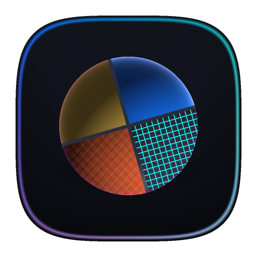

<p align="center">
  
</p>

<h1 align="center">Materialize</h1>

<p align="center">
  <strong>Substance Sampler & Designer GPU Edition for Unreal Engine 5</strong><br>
  <em>Real-Time GPU-Accelerated PBR Material Generation & Procedural Authoring</em><br>
  <em>Unreal Engine 5.4 – 5.8 | Win64</em>
</p>

<p align="center">
  <a href="../../releases"></a>
  
  
  
</p>

---

## Overview

**Materialize** is an all-in-one material creation suite built directly into Unreal Engine 5. It brings the full power of tools like **Substance Sampler** and **Substance Designer** into the editor using native HLSL compute shaders and Unreal's Render Dependency Graph (RDG).

Generate production-ready PBR texture sets from a single photo, author procedural materials with an interactive node graph, batch process entire directories of textures, and bake everything into optimized game assets—with zero external tools, no Python dependencies, and no third-party subscriptions.

> [!NOTE]
> *This repository has a clean commit history because Materialize was previously developed inside a private monorepo. It has now been separated and made public on GitHub.*

---

## Architecture: Two Unified Workflows

```
┌──────────────────────────────────────────────────────────────────────────────────┐
│                              MATERIALIZE PLUGIN                                  │
├──────────────────────────────────────────────────────────────────────────────────┤
│                                                                                  │
│  ┌─────────────────────────┐          ┌─────────────────────────┐                │
│  │    Sampler Workflow     │          │    Designer Workflow    │                │
│  │   (Photo → PBR Maps)    │          │  (Procedural Nodes)     │                │
│  ├─────────────────────────┤          ├─────────────────────────┤                │
│  │ • Single image input    │          │ • Node-based canvas     │                │
│  │ • Parameter sliders     │          │ • Visual connections    │                │
│  │ • 30+ Material presets  │          │ • Live node previews    │                │
│  │ • Channel thumbnails    │          │ • 3D preview viewport   │                │
│  │ • 3D mesh preview       │          │ • Graph compilation     │                │
│  └───────────┬─────────────┘          └───────────┬─────────────┘                │
│              │                                    │                              │
│              ▼                                    ▼                              │
│  ┌───────────────────────────────────────────────────────────────────┐          │
│  │                    SHARED GPU COMPUTE CORE                        │          │
│  ├───────────────────────────────────────────────────────────────────┤          │
│  │  • Render Dependency Graph (RDG) pipeline                         │          │
│  │  • Sobel gradient passes & Jacobi height iterative solver (24x)    │          │
│  │  • Poisson normal reconstruction & edge-based roughness           │          │
│  │  • Specular metallic analysis & ambient occlusion                 │          │
│  │  • Seamless tiling algorithms (cross-blend & mirror-blend)        │          │
│  │  • 20+ Photoshop-style blend modes & convolution filters         │          │
│  └───────────────────────────────────────────────────────────────────┘          │
│                                                                                  │
│                                 OUTPUT                                           │
│  ┌───────────────────────────────────────────────────────────────────┐          │
│  │ • BaseColor, Normal, Roughness, Metallic, Height, AO, Emissive    │          │
│  │ • Channel-packed ORM Texture (R=AO, G=Roughness, B=Metallic)      │          │
│  │ • Auto-generated Material Instance wired to Master Material       │          │
│  └───────────────────────────────────────────────────────────────────┘          │
└──────────────────────────────────────────────────────────────────────────────────┘
```

---

## Key Features

### 1. Sampler Workflow (Photo → Full PBR Set)
Drop any source image or photo into the editor to extract complete physical material maps:
- **Sobel Gradient Pass:** First-order spatial derivatives (`dx`, `dy`).
- **Jacobi Height Solver:** Multi-pass iterative solver (24 passes default) reconstructs accurate height/displacement from image gradients.
- **Poisson Normal Reconstruction:** Computes detailed tangent-space normal maps from height gradients.
- **Roughness & Metallic Estimation:** Specular analysis and high-frequency edge isolation.
- **Ambient Occlusion:** Height-based horizon occlusion.
- **Seamless Tiling:** Automated cross-blend and mirror-blend algorithms turn non-repeating photos into tileable textures.
- **ORM Channel Packing:** Packs Ambient Occlusion (R), Roughness (G), and Metallic (B) into a single optimized texture.
- **Auto Material Instances:** Automatically builds and assigns a ready-to-use Material Instance.

### 2. Designer Workflow (Procedural Node Graph)
A native node-based graph editor for authoring procedural textures and materials:
- **`UMaterializeGraph` Asset:** Custom graph asset with visual pin typing and validation.
- **Live Node Previews:** Every node renders an interactive thumbnail preview evaluated on the GPU.
- **3D Preview Viewport:** Real-time 3D lighting viewport with multiple primitive meshes and HDRI studio lighting.
- **Node Library:**
  - **Generators & Noise:** Perlin, Simplex, Voronoi, Cellular, FBM with tiling controls.
  - **Blend Modes (20+):** Normal, Multiply, Screen, Overlay, Soft Light, Hard Light, Color Dodge, Color Burn, Linear Light, Vivid Light, Hard Mix, Difference, Exclusion.
  - **Filters:** Gaussian Blur (separable), Sharpen, High Pass, Edge Detect, Emboss, Directional Blur, Warp/Distort.
  - **Adjustments:** Levels (Black/White/Gamma), Curves, HSV Shift, Brightness/Contrast, Posterize, Gradient Map.
  - **Math:** Add, Subtract, Multiply, Min, Max, Power, Invert.
  - **Output:** PBR Channel outputs with 1-click bake to persistent `UTexture2D` assets.

### 3. Batch Processor
Bulk convert whole asset directories without opening files individually:
- Drag and drop folders of reference images.
- Asynchronous GPU compute queue.
- Configurable preset profiles (Wood, Metal, Stone, Fabric, Ground).

### 4. 30+ Material Presets & Shading Models
Included master materials and custom HLSL shader implementations:
- **Standard PBR:** GGX microfacet distribution, Smith visibility, Fresnel-Schlick.
- **Specialized Models:** Clear Coat, Dual Lobe specular, Subsurface scattering, Anisotropic metal specular, and Fresnel Rim.
- **Stylized / Toon:** Cel shading, configurable light bands, rim lighting, and Sobel outline detection.

---

## Requirements

- **Engine Versions:** Unreal Engine 5.4, 5.5, 5.6, 5.7, 5.8
- **Platform:** Windows (Win64)
- **DirectX:** DirectX 11 or DirectX 12 with Compute Shader support
- **Dependencies:** None! Pure C++ & HLSL compute shaders. No Python or external DCC required.

---

## Installation

### Option A: Pre-built Binaries (UE 5.8)
1. Download `Materialize-v1.0.0-UE5.8-Win64.zip` from the [GitHub Releases](../../releases) page.
2. Extract the `Materialize` folder into your project's `Plugins/` directory:
   ```text
   YourProject/
   └── Plugins/
       └── Materialize/
           ├── Materialize.uplugin
           ├── Binaries/
           ├── Content/
           ├── Scripts/
           ├── Shaders/
           └── Source/
   ```
3. Launch your project in Unreal Engine 5.8. When prompted, enable the plugin and restart.

### Option B: Building from Source (UE 5.4 – 5.8)
1. Clone this repository into your project's `Plugins/` folder:
   ```bash
   cd YourProject/Plugins
   git clone https://github.com/ephemara/Materialize-UE5.git Materialize
   ```
2. If compiling for UE 5.4 – 5.7, open `Materialize.uplugin` in a text editor and match the engine version to your project.
3. Right-click your `.uproject` file and select **Generate Visual Studio project files**.
4. Open the solution in Visual Studio or Rider and compile in the **Development Editor** configuration.

---

## Quick Start

### Quick PBR Generation
1. Right-click any texture in your Content Browser.
2. Select **Generate PBR Material**.
3. Choose a preset or tweak sliders in the **Materialize Editor** window.
4. Click **Save** to generate the textures, ORM pack, and Material Instance.

### Procedural Graph Authoring
1. Right-click in the Content Browser → **K-Studio** → **Materialize Graph**.
2. Open the graph, press **Tab** or right-click to spawn Noise, Blend, or Filter nodes.
3. Wire your nodes into the **Output** node and inspect the live 3D preview viewport.
4. Click **Bake** to export your material maps.

---

## License

This project is licensed under the MIT License - see the [LICENSE](LICENSE) file for details.
